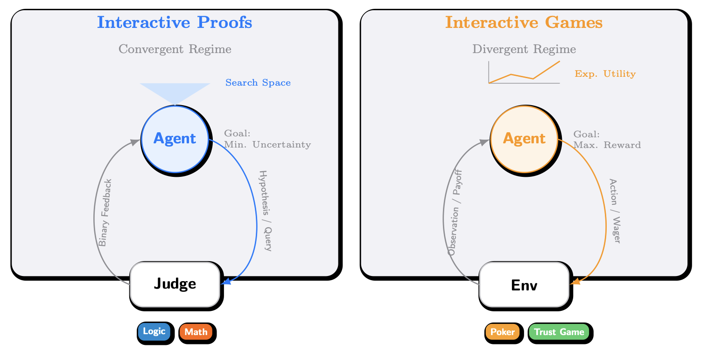

# InteractiveBench

欢迎来到论文 Interactive Benchmarks 的官方仓库！



## 仓库内容一览

- **`src/situation_puzzle/`**: 情景推理。
- **`src/math/`**: 数学交互式评测流水线：naive 解题 vs Interactive Proof式解题，以及 pass@k 评测范式作为对比。
- **`src/trust_game/`**: 信任游戏循环赛（baseline + LLM）。

## 快速开始

### 环境要求

- Python **3.10+**
- 你需要有可用的模型调用端点（本仓库多数脚本默认使用 **OpenRouter 的 OpenAI-compatible API**）

### 统一的环境变量（建议）

多数脚本会读取以下变量（可写进各子目录的 `.env`，或直接 export）：

- **`OPENROUTER_API_KEY`**：必需
- **`OPENROUTER_BASE_URL`**：可选，默认 `https://openrouter.ai/api/v1`

示例：

```bash
export OPENROUTER_API_KEY="sk-..."
export OPENROUTER_BASE_URL="https://openrouter.ai/api/v1"
```

### 依赖安装建议

```bash
pip install -r requirements.txt
```

> 说明：不同任务只需要其中一部分；请以各子目录 README 为准。

## 目录结构

```text
InteractiveBench/
  README.md
  LICENSE
  src/
    trust_game/
    situation_puzzle/
    math/
    poker/
```

## 结果产物与复现

- **结果落盘**：多数脚本会把运行结果落到各自目录下的 `results/`（或你指定的输出目录），并尽量包含可复现的 meta 信息（模型名、超参等）。
- **断点续跑**：多数脚本支持“输出文件存在则跳过已完成样本/对局”的 resume 逻辑（具体见各子目录 README）。

## 贡献

- 贡献规范见 `CONTRIBUTING.md`（新增 benchmark 子目录、结果格式、README 要求等）。

## 引用 / 使用许可

- **License**：MIT（见 `LICENSE`）
- 如你在论文/报告中使用本仓库的评测流程，建议在引用中注明：仓库名 + 运行的子 benchmark + commit hash（若你 fork 并有修改）。
